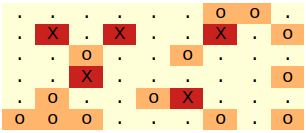
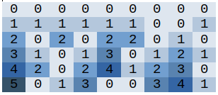
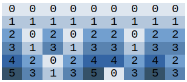
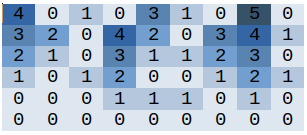
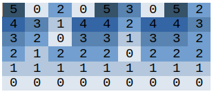
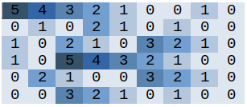
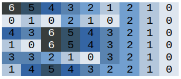
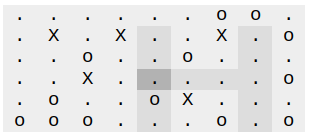

## Task

#### Construction platform in the experimental area

 The experimental area is divided into squares representing a rectangular grid, the rows of which are oriented in the east-west direction and the columns in the north-south direction.

 Construction platform for the experimental building in this area will consist of a common number of squares, which **will form shape resembling the capital letter 'H'**. The building area will consist of three wings - the west wing, the east wing and the central wing (binding). Each wing will be a straight row of several adjacent squares, the width of the wing will be exactly one square.

 The west wing and the east wing will be oriented in a north-south direction, will be the same length and will lie in same rows of the grid. The central wing will be perpendicular to the two remaining wings and will be ajacent to both. It must contain at least one square and must not be adjacent to either the northen or the southermost squares of the two remaining wings.

 Based on a detailed geological and pedological survey, the quality of each square was determined. There are three levels of quality: Good ('.'), Uncertain ('o') and Bad ('X'). An essential limiting condition for a building area is that **it must not contain any squre of poor quality ('X') and may contain no more than one square of uncertain quliaty ('o')**.

 The building committee is looking for building area of maximum size while maintaining the conditions stated above. The size of the building is equal to the number of all squares that the building area contains.

  
  
  

#### Input (example)

`6 9`   number of rows & number of cols   
`......oo.`  
`.X.X..X.o`  
`..o..o...`  
`..X.....o`  
`.o..oX...`  
`ooo...o.o`  

#### Output (example)

`12`  number of squares of biggest possible shape 

## Solution

 In order to obtain time complexity of the programme as small as possible (which was the main goal of these tasks) it is needed to do some pre-processing calculation over the input data. Matrices describing how many clean or dirty elements (clean - only dots, dirty - dots and maximum of one circle) are over, under and to the right of each element in given matrix can be used to calculate maximal shape from each possible position in matrix during final iteration. 

  

'Up matrices' expressing how many clean (respectively dirty) elements are over each element in given matrix:

  
  

'Down matrices' expressing how many clean (respectively dirty) elements are under each element in given matrix:

  
  

'Right matrices' expressing how many clean (respectively dirty) elements are to the right of each element in given matrix:

  
  

Solution:

  

#### Compiling and testing

`gcc main.c -o main`  
`./main < datapub/pub**.in`

